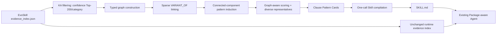

# Graph-enhanced Skill Compilation（GESC）设计与实验协议

## 1. 研究目标

GESC 是建立在现有 EvoSkill Compiler 之上的独立增强基线，方法标识为 `graph_evoskill_compiler`。它不替换、不修改 `evoskill_compiler`，也不改变 Package-aware Agent 的运行时检索与回答逻辑。唯一干预变量是 **Skill 编译方式**：把扁平知识原子（Knowledge Atom, KA）组织为有类型知识图，并从图中归纳、选择 Clause Pattern，再生成 `SKILL.md`。

该设计直接回答以下研究问题：在知识抽取结果、Agent、模型、数据划分和运行参数保持相同的情况下，显式建模知识原子之间的结构关系，能否提升 Skill 对条款变体、条件、例外以及 no-answer 边界的表达能力？

## 2. 公平对照与因果边界

| 组成 | EvoSkill | GESC | 是否变化 |
|---|---|---|---|
| 训练合同与 KA | 原始 EvoSkill KA | 直接复用同一 `evidence_index.json` | 否 |
| 安全策略 | EvoSkill policy | 直接复用同一 policy | 否 |
| Skill 编译输入 | 每类置信度 Top-30 KA | 每类 Top-200 KA 构图，图选择 6 个 Pattern | 是 |
| Skill 编译 | 扁平 KA 提示 | Pattern Card 提示 | 是 |
| 运行时 Agent | Package-aware Agent | 同一 Agent | 否 |
| 运行参数 | chunks=10, knowledge=6 | chunks=10, knowledge=6 | 否 |
| 输出证据索引 | 原始 KA 索引 | 原样复制 | 否 |

因此，主对照 `evoskill_compiler` vs. `graph_evoskill_compiler` 的差异可归因于图增强编译，而不能被解释为重新抽取 KA 或更换运行时 Agent。

## 3. 总体架构



GESC 是 compile-time augmentation，而不是 runtime Graph-RAG。这是第一阶段最可控的基线：若指标改变，可以明确定位到 Skill 组织方式。运行时图检索应作为后续独立实验，不应与本基线混合。

## 4. 图模式

### 4.1 节点类型

- `KnowledgeAtom`：原始 KA，仅在图中保存 ID、类别、置信度以及条件/例外标记；全文仍保存在证据索引和 Pattern Card 中。
- `ClausePattern`：一组语义/词汇近邻 KA 归纳出的条款模式。
- `Category`：CUAD 条款类别，是强类型边界。
- `Contract`：KA 的来源合同，用于来源多样性和可追溯性。

### 4.2 边类型

- `BELONGS_TO(KA, Category)`：类别约束。
- `DERIVED_FROM(KA, Contract)`：来源追踪。
- `VARIANT_OF(KA, KA)`：同类别内的条款变体，权重为 token Jaccard。
- `INSTANCE_OF(KA, ClausePattern)`：KA 到聚类模式的归属。

第一版不让 LLM预测 `EXCEPTION_TO` 或 `CONDITION_OF` 的目标节点，因为错误关系会比缺失关系更危险。条件与例外先通过 cue detection 作为节点/Pattern 属性进入编译提示。未来只有在人工标注小样本验证关系精度后，才升级为显式有向边。

## 5. 算法

### 5.1 候选 KA

每个类别按 `confidence` 降序选择最多 200 个 KA。该上限比原编译的 30 个更有机会覆盖长尾措辞，但不会改变运行时使用的完整证据索引。参数为：

```text
graph_ka_limit = 200
```

### 5.2 稀疏变体边

对 KA 的 `text + interpretation` 规范化分词并去除高频法律停用词。只比较共享至少两个有效 token 的同类别候选；倒排项超过 80 个 KA 的词不参与候选生成，以避免泛化词制造稠密图。对每个节点最多保留 6 条超过阈值的出边：

```text
similarity = |tokens_i ∩ tokens_j| / |tokens_i ∪ tokens_j|
similarity_threshold = 0.24
max_neighbors = 6
```

这是透明、确定性、无需新增 embedding 模型的基线。它并不宣称是最终语义图算法，而是为检验“结构化编译是否有增益”提供最低混杂实现。

### 5.3 Clause Pattern 归纳

同类别图采用**中心原子约束的星型聚类**形成候选 Pattern：按置信度顺序处理 KA，只有当一个 KA 与某个 Pattern 中心原子的相似度达到阈值时才并入，否则建立新 Pattern。这里不采用普通连通分量，因为法律模板容易发生 chaining：`A≈B`、`B≈C` 并不保证 `A≈C`，连通分量会把语义边界不同的条款逐步吞并。星型约束保证每个成员都与中心直接相似。每个候选的排序分数为：

```text
S(P) = 0.45 mean_confidence
     + 0.30 log(1 + source_contract_count)
     + 0.20 log(1 + mean_degree)
     + 0.15 I(has_condition_or_exception)
```

每类最多保留 6 个 Pattern。该分数同时奖励可靠性、跨合同复现、图中心性和边界信息，避免只选择高频模板。

### 5.4 代表例句

每个 Pattern 最多选 3 个 KA。选择函数以置信度和度中心性为主，并奖励新来源合同、惩罚与已选例句的 Jaccard 冗余。这一步把此前 EvoSkill v4 中有效但由提示词隐式完成的 “Example Phrasing” 升级为确定、可审计的图选择过程。

### 5.5 Pattern Card

每张 Card 包含：类别、成员数、来源合同数、选择分数、10 个 variation cues、条件/例外标记，以及最多 3 个带 KA ID 和来源合同的代表例句。编译 LLM 只能依据 Card 与安全策略生成 Skill，不得发明法律规则或目标合同证据。

## 6. 产物与可审计性

每个 case 输出到：

```text
results/skillgen/generated/graph_evoskill_compiler/{case_id}/
├── SKILL.md
├── skill_manifest.json
├── evidence_index.json       # 与源 EvoSkill 相同
├── security_policy.json      # 与源 EvoSkill 相同
├── generation_log.json
├── knowledge_graph.json      # 完整节点、边和统计
└── pattern_cards.json        # 实际进入编译器的图摘要
```

数据源：

- KA：`results/skillgen/generated/evoskill_compiler/{case_id}/evidence_index.json`
- 安全策略：`results/skillgen/generated/evoskill_compiler/{case_id}/security_policy.json`
- CUAD-SkillGen case 与任务：`data/cuad_skillgen/`
- 实现：`scripts/baselines/graph_evoskill_compiler.py`

## 7. 运行方法

先做不调用 LLM 的全 case 图诊断：

```powershell
python scripts/baselines/graph_evoskill_compiler.py --dry-run
```

编译单个 case：

```powershell
python scripts/baselines/graph_evoskill_compiler.py --case-id assignment_and_control --model ecnu-plus
```

编译全部 case：

```powershell
python scripts/baselines/graph_evoskill_compiler.py --model ecnu-plus
```

使用当前相同运行参数测评：

```powershell
python scripts/run_package_runtime.py --method graph_evoskill_compiler --split test --run-id graph-k10-k6 --top-k-chunks 10 --top-k-knowledge 6
python scripts/evaluate_academic_judge.py --method graph_evoskill_compiler --split test --run-id graph-k10-k6
```

## 8. 主指标与消融实验

主结果应报告：Task Success、Status Macro-F1、Balanced Accuracy、No-answer Recall、Academic Score、Semantic Evidence Validity 和 Containment-aware Evidence F1。Strict Evidence F1 只作为对齐诊断，不作为 Skill 质量主结论，因为它对完整引文与 gold 子 span 的边界差异高度敏感。

最低限度消融：

1. `EvoSkill v4`：当前扁平 Top-30 + Example Phrasing。
2. `GESC-full`：完整图选择。
3. `GESC-no-centrality`：Pattern 排序去掉 degree 项。
4. `GESC-no-source-diversity`：代表例句不奖励新合同来源。
5. `GESC-random-patterns`：保持 Card 数量与 token 预算，随机选 Pattern/例句。

若 `GESC-full` 仅改善 strict/containment evidence 而不改善 Semantic Evidence Validity，说明它主要影响引文边界；若改善 Macro-F1/No-answer，说明 Pattern 的条件与例外表达改善了判定边界；若只改善 Academic Score，则可能是回答组织更清楚，而非任务能力提升。

## 9. 风险与下一阶段

- 词法 Jaccard 会漏掉低词面重合的真正语义变体；可在小规模确认后替换为 embedding/kNN，但必须单独报告模型与成本。
- 星型聚类避免了连通分量 chaining，但中心顺序仍可能影响边界；当前用置信度降序保证确定性，并应报告最大 Pattern 占比和 singleton 比例。
- 高置信度 KA 可能仍包含类别误映射；图会放大系统性噪声，因此需要报告 singleton 比例、最大分量大小和来源覆盖。
- 当前图不参与 query-time 检索。只有当 compile-time GESC 被证明有效后，才建议新增 `Graph-RAG Agent`，按 `query → category → pattern → KA → target chunks` 做第二阶段独立实验。

## 10. 可证伪假设

论文中的合理假设不是“图一定更好”，而是：**在相同 KA 和 Agent 下，显式 Pattern 结构应提高条款变体与边界条件的可学习性。** 若 GESC 没有超过 EvoSkill v4，则应据图统计判断原因：词法边不足、Pattern 过碎、chaining 过强，或运行时 top-k 检索才是瓶颈。这个结果仍能区分“知识组织不足”和“运行时检索不足”，具有研究价值。
