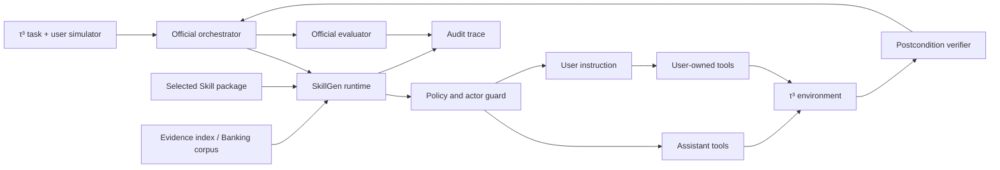

# τ³-SkillBench Agent Runtime 设计

## 1. 设计目标

运行时承担的是“公平加载不同 Skill 包，并在 τ³ 原生环境中留下可评价轨迹”，而不是在评测时再次优化 Skill。它必须满足四项性质：与官方环境兼容、支持 Telecom 双控制、支持 Banking 知识检索、可断点恢复且可审计；同时确保所有主方法与消融之间唯一的主要自变量是编译产物。

当前实现入口为 `scripts/run_agent_runtime.py`。它向 τ³ registry 注册 `skillgen:<run_id>` agent factory，保留官方 task loader、user simulator、environment tools、orchestrator 和 evaluator。默认 `hard_progressive_advisory` 模式先注入紧凑模块目录，再由模型显式调用内部 `activate_skill`；runtime 强制加载完整模块后才允许模型生成业务工具调用。`package_v1`、`prompt_only` 和 `full_injection` 仅作为兼容或消融模式。运行完成后，官方 Results 保存到本项目 `results/runs/<run-id>/results.json`。

## 2. 总体架构



主实验使用 task-specified domain/Skill routing。路由器只按实验配置选择 `<method>/<domain>/SKILL.md`，不读取任务 gold，也不根据结果回退到另一 Skill。这样可把研究问题限制为编译质量；自主路由作为独立扩展变量。

## 3. 输入、状态与输出契约

### 3.1 运行输入

```json
{
  "run_id": "evoskill-telecom-s42",
  "method": "evoskill_compiler",
  "domain": "telecom",
  "split": "test",
  "task_ids": null,
  "agent_model": "<frozen-model>",
  "user_model": "<frozen-simulator-model>",
  "seed": 42,
  "num_trials": 1,
  "skill_sha256": "...",
  "runtime_adapter_sha256": "..."
}
```

Agent 可见当前对话、环境返回、实际 tool schemas、固定 adapter 和 Skill；不可见任务 ticket、reference actions、assertions、reward basis、required documents 或 evaluator 分数。

### 3.2 内部过程状态

运行时以轻量状态机约束推理过程：

`observe → retrieve → clarify/check → decide → execute | instruct_user | deny | escalate → verify → complete | failed`

- `observe`：从对话和只读工具确认实体及环境状态；
- `retrieve`：定位适用政策、Knowledge Atom 或 Banking 文档；
- `clarify/check`：补足关键参数、前提、权限与例外；
- `decide`：形成带 provenance 的动作/拒绝/转人工决定；
- `execute`：仅调用 assistant-owned tool；
- `instruct_user`：说明操作及目的，由 user simulator 调用 user-owned tool；
- `verify`：读取后置状态，核对必要沟通；
- `complete/failed`：只有证据支持时完成，否则明确失败或升级。

v1 通过 `PackageAwareAgent` 继承官方 LLMAgent，不修改消息协议；它在每轮生成前对 Skill sections、允许的 atoms/rules/workflows/patterns 执行确定性 BM25，并把 query、命中项、分数、来源、预算和 package hash 写入 assistant `raw_data`。该 sidecar 不依赖模型自报。

### 3.3 运行输出

每个 run 产生：

- `run_manifest.json`：数据、模型、Skill、adapter、seed、检索和预算哈希；
- `results.json`：τ³ 原生 `Results`，含 messages、termination、reward_info 和 breakdown；
- `metrics.json`：由 `scripts/evaluate_results.py` 离线汇总；
- 后续 `audit_trace.jsonl`：actor ownership、decision status、provenance、guard 与 postcondition 事件；
- `failures.jsonl`：基础设施、上下文超限、用户模拟器和 agent 失败分类。

## 4. 核心组件

### 4.1 Skill Loader

按 manifest 读取 Skill 包并校验 SHA-256。包内可含 `SKILL.md`、`evidence_index.json`、`security_policy.json`、`workflow_patterns.json`，GESC 另含 `knowledge_graph.json` 和 `pattern_cards.json`。缺失必需文件时 fail closed，不退回原政策以免改变实验方法。

### 4.2 Evidence Retriever

Retail/Airline/Telecom 主实验对所有方法固定相同检索器与总预算；工具 schema 始终由环境直接注入。所有方法检索自身 Skill sections；Raw、Document Tool、EvoSkill 与 GESC 再按方法定义开放原生附件。配置、查询和预算一致，但不能让弱基线读取其方法本不产生的 EvoSkill 规则/工作流。GESC Pattern Cards按普通文本检索，v1 不读取 `knowledge_graph.json`。

Banking 有两个不可混淆的层次：

1. **任务知识语料检索**：τ³ 官方 Banking corpus，固定 retrieval config 与 top-k；
2. **Skill 过程知识**：如何检索、验证和作答的政策/Pattern，不得包含任务的 required-document label。

建议主实验使用官方可复现的 RAG 配置 top-k=10；`alltools` 只作为检索上界或兼容诊断，因为把全部文档工具暴露给模型可能改变上下文与选择难度。七种方法必须共用同一 Banking 检索配置。

### 4.3 Policy and Actor Guard

Guard 在 consequential action 前检查：工具 requestor、实体/参数完整性、政策许可、禁止条件、确认/认证要求与升级条件。其输出为 `allow`、`clarify`、`instruct_user`、`deny` 或 `escalate`。主实现当前通过统一 adapter 与 Skill policy 提示实现；强制式 guard 属于后续消融，若启用必须对所有方法同样启用。

Telecom 双控制是核心区别：assistant 工具只能由 agent 调用；设备侧 user tools 必须通过自然语言指令让模拟用户执行。禁止把 user tools 合并给 agent 的 solo mode。Actor Ownership Accuracy 和 Illegal Cross-Actor Tool Rate 均从消息/工具事件离线计算。

### 4.4 Executor 与 Postcondition Verifier

Executor 每次只执行一个可解释的关键动作，保留 tool name、actor、arguments、result/error 和 source IDs。写操作失败时不得盲目重复：先重新观察状态，区分幂等可重试、参数错误、政策阻断和不可恢复失败。

Verifier 不读取 gold，而根据可见环境结果判断是否需要继续。官方 evaluator 在会话结束后独立检查 DB、environment、communication、NL 和 action reward，Agent 不接收 evaluator 反馈。

## 5. 增量与恢复语义

数据和 Skill 生成采用 content hash：源文件未变化则跳过；任一编译源变化只重建对应 domain/method。运行以 `run_id + task_id + trial + seed` 为工作单元，τ³ 的 checkpoint/auto-resume 保留已经完成的单元。恢复必须校验 Skill、adapter、模型与 retrieval hash；任一不一致则创建新 run，不得把异构结果拼接。

并发只改变调度，不改变 seed。主实验冻结 `max_concurrency` 和 provider limits；API rate-limit 重试记录为 infrastructure event。所有输出先写官方 checkpoint，再保存工作区副本，避免中断导致结果文件只写一半。

## 6. 完整实验案例 Mock

Mock 文件为 `results/mock/telecom_dual_control_case.json`，它用于验证链路和解释 actor ownership，不作为 benchmark 分数。

**输入。** Telecom test 用户 John Smith 在法国，移动数据不可用；设备开启 data saver、关闭 device roaming。Agent 获得用户话语、当前工具和 Telecom Skill，不获得 gold action/assertion。

**操作。** Runtime 先识别客户和可见服务状态；Skill 将问题分解为设备侧条件与账户侧条件。Agent 请求用户关闭 data saver，用户通过 `toggle_data_saver_mode` 执行；随后请求用户开启 device roaming，用户通过 `toggle_roaming` 执行；最后由用户运行 speed test，Agent 仅在返回 excellent 后确认完成。

**输出。** τ³ 环境期望 mobile data active 且 speed=excellent；actor ownership 为 1.0、越权调用为 0，原生 ENV_ASSERTION reward 目标为 1.0。Mock 中的 gold 只存在于离线 `expected_output`，没有进入编译或运行输入。

该案例体现论文希望捕获的差异：普通摘要可能只给出“检查漫游”，而多维度 Skill 需要同时表达状态诊断、先后条件、assistant/user 边界、失败后的继续排障以及完成前验证。

## 7. 公平性与安全失败策略

- Skill 超长不得通过为某一方法单独扩充 context window 解决；应在编译阶段做索引化，再统一 runtime budget；
- 工具异常、供应商超时和 user simulator hallucination 分开标记，不自动归因于 Skill；
- policy/knowledge 冲突时优先原始 source，记录冲突并拒绝无依据的 consequential action；
- 检索为空时允许澄清或升级，不得虚构文档；
- 正式实验后不得依据 test 错误修改 Skill，再继续写入同一 run；任何修改产生新 compiler version 和 run id。

## 8. 实现阶段

当前已完成 P0：冻结 τ³ 资源、四领域规范化、11 个主方法与 3 个消融的 56 个 Skill 包、官方 registry 适配器、progressive runtime、dry-run manifest、原生/动作结果汇总器、audit trace extractor 和 Telecom mock。τ³ Python 3.12 环境也已锁定。下一阶段为 P1：冻结 runtime/user models 与凭据，执行每领域单任务 live smoke test。P2 运行主矩阵与配对统计；P3 再运行三项消融、Telecom full、第二模型和自主域路由。

## 9. Progressive Runtime v2 的实际契约

1. `ProgressiveSkillPackage` 只将 `SKILL.md`、`manifest.json` 与 `action_modules.json` 作为语义运行输入；图文件被列为 ignored compile-time files，runtime 不遍历图；
2. catalog 在 12,000 字符预算内逐级压缩描述和工具摘要，但绝不静默删除模块 ID；
3. `activate_skill` 是内部上下文加载工具，不进入 τ³ 业务环境，也不计入业务 Tool Selection Accuracy；
4. 激活状态保存在 `ProgressiveSkillAgentState`，按 simulation 隔离，可恢复、可重放；每个任务最多激活两个模块；
5. 激活请求与业务工具出现在同一模型响应时，runtime 拒绝同轮业务调用并要求下一轮重新生成，保证模块先加载、动作后执行；
6. 激活轮的 token 与费用并入最终 assistant message，墙钟耗时自然包含在 simulation duration 中，避免把 progressive routing 成本漏报；
7. `raw_data.skillgen_activation` 记录 module ID、source atoms、required tools、trace requirements、上下文字符数与 package hash，用于离线审计。
