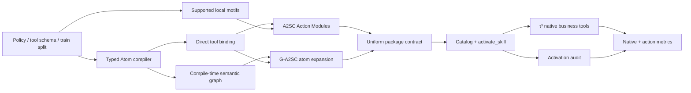

# A2SC / G-A2SC 与 Agent Runtime 实现审查报告

## 1. 审查结论

截至 2026-08-13，新算法、统一 progressive runtime、主基线适配、三项核心消融、轨迹抽取、自动评价、人工标注与增量矩阵脚本均已落地。离线状态为：19 项测试通过，56 个方法—领域 package 静态审计通过，上游 commit、数据 manifest、Python 3.12 runtime 与 τ³ import 检查通过。

该结论仅说明代码链路符合当前设计并可进入 live smoke test；它不证明 A2SC 或 G-A2SC 性能优于基线。当前没有模型凭据、formal Skill package 或真实 `results.json`，因此不能报告成功率提升。

## 2. 实际实现链路



算法实现位于 `scripts/action_compiler.py`，package 生成位于 `scripts/generate_skills.py`。A2SC 使用类型化原子、工具 schema 的直接归属、政策原子的词面绑定和至少两次训练支持的局部 motif。G-A2SC 复用同一工具卡、模块 ID、required tools、runtime 和预算；语义图只扩展政策来源的条件、禁止、例外、验证、确认、升级、沟通或许可原子，避免把不同工具共有的参数误当作语义图贡献。

## 3. 基线与消融边界

| 类别 | 方法 | progressive runtime 中的适配方式 | 明确不具备的能力 |
|---|---|---|---|
| 控制 | `no_skill` | 无模块、无激活工具 | 域 Skill 知识 |
| 原文/提示 | `raw_policy_rag`、`native_prompt_skill`、`schema_prompt_skill`、`summary2skill` | 将各自 `SKILL.md` 分段为模块 | A2SC 工具绑定 |
| 工具包装 | `document_tool_maker`、`tool_schema_compiler` | 每个工具一个模块 | 训练 motif；后者也无政策原子 |
| v1 兼容 | `evoskill_compiler`、`graph_evoskill_compiler` | 只分段各自 v1 `SKILL.md` | 不继承 A2SC action compiler |
| 提出方法 | `a2sc`、`g_a2sc` | 工具中心 Action Module | G-A2SC 之外无图扩展 |
| 消融 | `a2sc_no_typed_atoms` | 原 policy section 模块 | runtime 可见 typed atoms |
| 消融 | `a2sc_no_tool_binding` | 按 atom type 打包 | primary/required tool 绑定 |
| 消融 | `a2sc_no_local_motifs` | A2SC 工具模块但 motif 为空 | 顺序、前置读与验证读代理 |

`g_a2sc_no_graph` 不复制新方法；A2SC 本身就是共享 runtime 与预算的 no-graph 直接对照。

## 4. Runtime 审查

`ProgressiveSkillAgent` 的激活是模型发起、runtime 执行的硬加载，不是把全部 Skill 一次性拼到 prompt。首轮只提供可压缩但不丢 ID 的 catalog；激活后完整模块进入 system policy，随后模型重新生成业务响应。激活工具不暴露给 τ³ environment，业务工具仍全部来自官方 schema。

状态已从 agent 实例字段迁移到 `ProgressiveSkillAgentState`，因此激活模块和事件按 simulation 隔离。模型若把 `activate_skill` 和业务工具混在同一响应，runtime 会为业务调用写入内部错误并要求下一轮生成，避免“先执行、后加载”。隐藏激活轮的 usage/cost 会合并到最终 assistant message；最终 `raw_data` 保留 module、atom、required tools、trace requirements、字符预算和 package hash。

G-A2SC runtime 不读取 `knowledge_graph.json`。图对最终模块内容的影响已在编译期固化，运行期只读与 A2SC 相同的 `action_modules.json` 契约。这保证 A2SC 与 G-A2SC 的差异来自编译结果，而不是额外图检索调用、延迟或上下文预算。

## 5. Review 中发现并修复的问题

1. **旧基线能力污染**：v1 EvoSkill/GESC 曾错误复用 A2SC 工具模块。现已改为只分段各自 Skill，审计禁止出现 `primary_tool`；
2. **状态位置不严谨**：激活状态曾存于 agent 实例。现迁移到 simulation state，并增加硬加载单元测试；
3. **句子错误切分**：工具 docstring 的硬换行曾生成半句原子。现先折叠软换行，再按完整句切分；
4. **噪声 motif**：单次相邻动作和自环曾被编译为 SOP。现要求 support ≥ 2、删除自环，并只保留观测邻居或 confidence ≥ 0.4 的动作链；
5. **跨工具 schema 污染**：相似工具参数曾通过词面相似度互相绑定。现 schema/docstring 只归属声明工具，只有政策原子允许词面链接；
6. **图伪增强**：G-A2SC 曾可能连接不同工具共有参数。现语义扩展仅作用于政策来源的可执行原子；
7. **指标命名过强**：自动工具覆盖曾可能被误称 Tool Binding Accuracy。现仅报告带 `proxy` 后缀的描述指标，正式准确率由预注册标注计算；
8. **缺失消融与一致性工具**：已补齐三项消融、Route/Trigger 标注字段及 `evaluate_agreement.py`。

## 6. 已执行验证

```powershell
python scripts/audit_action_packages.py
vendor/tau3-bench/.venv/Scripts/python.exe -m pytest tests -q
python scripts/preflight.py
python scripts/run_agent_runtime.py --method a2sc --domain retail --agent-model dummy-agent --user-model dummy-user --dry-run
python scripts/run_agent_runtime.py --method g_a2sc --domain telecom --agent-model dummy-agent --user-model dummy-user --dry-run
python scripts/run_experiment_matrix.py --method a2sc_no_tool_binding --domain airline --seed 42 --num-tasks 1 --agent-model dummy-agent --user-model dummy-user --dry-run
```

验证结果：19 tests passed；56 packages passed；4 个领域的 A2SC/G-A2SC module IDs、primary tools 与 required tools 对齐。图扩展实际改变了 Retail 2 个、Airline 2 个、Telecom 23 个 runtime 模块指令；Banking Knowledge 为 0。这不是错误，但意味着不能预期或宣称 G-A2SC 在 Banking 依赖图机制获得优势。

## 7. 仍需 live 实验验证的风险

- 类型判断和政策—工具链接为确定性启发式，静态合法不等于语义完全正确；应在不查看 test reward 的 dev/标注样本上报告 atom type 与 binding precision；
- 最大两个模块可能限制多意图任务，也可能降低上下文成本；必须通过 Trigger Recall、Route@1、成功率与 token 成本共同判断；
- 局部 motif 来自训练参考轨迹，只是软提示。若消融显示无收益或负收益，应删除该机制，而不是在 test 上继续调阈值；
- Banking 的任务知识仍由官方 `KB_search`/BM25 层提供，Skill package 不得内联 `required_documents`；
- 当前 `skills_formal/` 为 0/56，且 live `results.json` 为 0。正式执行前必须冻结 compiler/backend、agent model、user model、context/turn/费用预算和标注协议。

## 8. 最终判定

代码已经达到“可执行 live smoke test”的第一版完成标准，且主要实现与当前 A2SC/G-A2SC 设计一致。最重要的公平性边界——基线不继承提出方法能力、G-A2SC 不在 runtime 做图检索、所有方法共享激活接口和业务工具——已由代码与静态审计同时约束。

尚不能判定“表现符合预期”。该判断只能在冻结配置后的真实 τ³ run、配对统计和预注册人工标注完成后作出。
