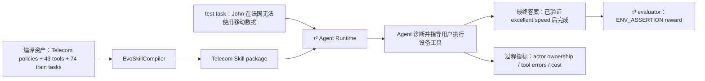

# 单次运行直观案例：Telecom 双控制移动数据修复

> 状态说明：本案例使用真实 τ³ test task、真实政策/工具资产和实际生成的 EvoSkill package。下述对话轨迹与分数是**期望成功路径的可执行模拟**，用于解释输入输出和检验脚本；尚未调用冻结 LLM，因此不是论文实验观测值。真实运行后，同一位置将由 `results.json` 中的模型轨迹替换。

## 1. 一张图理解全过程



## 2. 什么资产进入 Skill 算法

本次方法设为 `evoskill_compiler`，领域为 `telecom`。编译器读取且只读取：

| 资产 | 实际文件 | 数量 | 作用 |
|---|---|---:|---|
| 企业主政策 | `main_policy.md` | 与手册共同切成 51 个政策段 | 账户操作、认证、升级和服务规则 |
| 技术支持手册 | `tech_support_manual.md` | 同上 | 移动数据故障的诊断顺序、条件和验证方法 |
| 工具契约 | `tool_catalog.json` | 43 | 13 个 assistant tools、30 个 user tools及其参数和所有者 |
| 训练流程 | `tasks/train.jsonl` | 74 tasks，归纳出 67 种参考 workflow signatures | 提供常见过程结构；不把轨迹视为唯一正确路径 |

编译器**不读取**本案例所属的 `tasks/test.jsonl`、initial state、reference actions 或 environment assertions。其输入白名单与哈希记录在 `data/processed/telecom/manifest.json` 和 Skill `manifest.json`。

## 3. Skill 算法产生什么

该输入产生 `skills/evoskill_compiler/telecom/`：

- `SKILL.md`：运行时 SOP，约 32.5k 字符；
- `evidence_index.json`：94 个 Knowledge Atoms，其中 51 个政策 atom 和 43 个工具 atom；
- `security_policy.json`：可审计治理规则与状态集合；
- `workflow_patterns.json`：67 个 train-derived 流程模式；
- `manifest.json`：输入哈希、数量、编译后端与 `uses_held_out_tasks=false`。

对本案例最关键的编译结果不是记住答案，而是形成以下可复用结构：

```text
observe 当前状态
→ 区分账户侧 roaming 与设备侧 data roaming
→ 识别 data saver 和 device roaming 均由 user-owned tools 控制
→ assistant 只能指导用户执行，不能越权代调用
→ 每次改变后观察状态
→ speed test 达到 excellent 才能 complete
```

## 4. 运行时收到什么输入

测试任务 ID：

```text
[mobile_data_issue]data_saver_mode_on|user_abroad_roaming_enabled_off[PERSONA:Easy]
```

用户首轮可见信息可简化为：

```text
我的移动数据无法使用或者非常慢。我叫 John Smith，号码 555-123-2002，
目前在法国，没有 Wi-Fi。我只接受 speed test 达到 excellent，
不想换套餐，但必要时可以加 2 GB 流量。
```

环境真实初始状态包括：data saver 开启、设备 roaming 关闭、用户在境外；账户侧 roaming 已开启。Agent 不直接看到这些初始化 action，只能通过对话和工具观察。

Agent 得到的系统输入是：

```text
固定 runtime adapter
+ EvoSkill Telecom SKILL.md
+ τ³ 当前环境的实际 tool schemas
```

Agent 看不到：应调用 `toggle_data_saver_mode`、`toggle_roaming` 的 gold 轨迹，也看不到最终两个 environment assertions。

## 5. 一次成功运行的输入—操作—输出轨迹

| 步骤 | 输入/观察 | Agent 决定或输出 | 环境结果 |
|---:|---|---|---|
| 1 | 用户报告境外移动数据异常 | 调用 assistant tool `get_customer_by_phone(555-123-2002)` 识别账户与线路 | 返回 `customer_id=C1001, line_id=L1002` |
| 2 | 账户信息可用 | 检查账户侧 roaming/流量状态；识别账户 roaming 已开启 | 排除运营商账户未开通问题 |
| 3 | 仍需检查设备状态 | “请检查状态栏和数据限制状态。” | user simulator 调用 `check_status_bar`、`check_data_restriction_status`，发现 data saver 开启 |
| 4 | data saver 开启 | “请关闭数据节省模式，然后再测试。” | user 调用 `toggle_data_saver_mode`；问题尚未完全解决 |
| 5 | 用户仍无服务且身处法国 | “账户侧漫游已开通，请在手机设置中开启数据漫游。” | user 调用 `toggle_roaming` |
| 6 | 两个阻断条件已解除 | “请运行一次网络测速。” | user 调用 `run_speed_test`，返回 `200 Mbps, excellent` |
| 7 | 有可见后置验证 | 最终答案：“数据节省模式和设备数据漫游设置已修正，测速达到 excellent，移动数据已经恢复。若之后再次异常，请重新检查这两项设置。” | 会话完成 |

关键点是：`toggle_*` 与 `run_speed_test` 是 user-owned tools。Agent 输出自然语言指令，由 user simulator 执行；若 Agent 自己调用它们，就是双控制越权。

## 6. 运行产生什么文件

真实调用：

```powershell
vendor\tau3-bench\.venv\Scripts\python.exe scripts\run_agent_runtime.py `
  --method evoskill_compiler `
  --domain telecom `
  --agent-model <冻结的Agent模型> `
  --user-model <冻结的用户模拟器模型> `
  --split test `
  --task-id "[mobile_data_issue]data_saver_mode_on|user_abroad_roaming_enabled_off[PERSONA:Easy]" `
  --seed 42 `
  --run-id case-telecom-evo-s42
```

输出目录：

```text
results/runs/case-telecom-evo-s42/
├─ run_manifest.json       # 模型、seed、Skill hash、adapter hash、状态
├─ results.json            # 完整对话、tool calls、tool results、reward_info
├─ audit_trace.jsonl       # 工具和检索事件
├─ audit_metrics.json      # actor ownership 与 tool error
└─ extended_metrics.json   # 原生和过程指标
```

## 7. 本案例评估什么，如何计算

该 task 的官方 `reward_basis=[ENV_ASSERTION]`，包含两个断言：

1. `mobile_data_status == true`；
2. `internet_speed == 200` 且描述为 `excellent`。

设两个断言是否满足为 `e₁,e₂∈{0,1}`，官方分量为：

```text
ENV_ASSERTION = e₁ × e₂
```

τ³ 的最终 reward 由 reward basis 中各分量相乘。本任务只有 ENV_ASSERTION，因此成功路径中：

```text
e₁ = 1, e₂ = 1
ENV_ASSERTION = 1 × 1 = 1.0
Final Reward = 1.0
Strict Task Success = 1[Reward = 1] = 1
```

若只恢复网络但测速未达 excellent，则 `e₁=1,e₂=0`。官方实现对 environment assertions 使用乘积门控，所以 `ENV_ASSERTION=0`、最终 reward 为 0。这正是该 benchmark 对完整流程而非部分完成的严格要求。

过程指标计算为：

```text
Actor Ownership Accuracy
= 所有 tool calls 中消息发送方 actor == tool call requestor 的次数 / tool calls 总数

Illegal Cross-Actor Tool Calls
= actor != declared requestor 的 tool calls 次数

Tool Error Rate
= error=true 的 tool results / tool calls 总数
```

例如本轨迹假设共有 7 次工具调用，3 次 assistant-owned、4 次 user-owned，全部由正确主体执行：

```text
Actor Ownership Accuracy = 7 / 7 = 1.0
Illegal Cross-Actor Tool Calls = 0
Tool Error Rate = 0 / 7 = 0
```

另报告 agent cost、duration、turns 和调用数。Actor ownership 在 τ³ 非 solo runtime 中也受到工具暴露机制的结构性保护，因此它主要是协议完整性检查，不能单独证明 EvoSkill 优越。本 task 没有 Banking 文档，因此 Required-document Recall/MRR 不适用；也不能从自动轨迹凭空计算 Status Macro-F1、Policy Compliance 或 Provenance Validity，它们需要预先定义的人类标注集。

## 8. 为什么这个案例能支持论文论点

它同时要求：政策/手册理解、账户状态诊断、设备状态诊断、assistant/user 工具分权、多轮失败恢复和后置验证。若 EvoSkill 相对摘要/原政策只提高最终措辞而不能提高 environment reward、actor ownership 或 verification recall，就不能证明“多维度 Skill 生成”优势；只有在同一任务、模型、seed 和工具预算下，EvoSkill/GESC 的这些指标稳定改善，论文主张才得到支持。

---

## 9. A2SC v2 单次运行：知识原子如何进入 Agent 行为

本节覆盖前述“完整 `SKILL.md` 常驻”的 v1 案例。使用同一个 Telecom 任务，但将方法替换为 `a2sc`，Runtime 替换为 `hard_progressive_advisory`。以下仍是可执行模拟，不是 live LLM 观测结果。

### 9.1 编译输入与类型化原子

A2SC 只读取 `main_policy.md`、`tech_support_manual.md`、`tool_catalog.json` 和 `tasks/train.jsonl`，不读取 test task 的 initial state、reference actions、environment assertions 或 reward。

相关原子示例：

```json
[
  {"atom_id":"ATOM-44c0327391","type":"precondition","subject":"Mobile Data Troubleshooting","text":"If check_data_restriction_status() shows Data Saver mode is ON, guide the user to use toggle_data_saver_mode() to turn it OFF.","origin":"policy"},
  {"atom_id":"ATOM-87542a2c06","type":"actor_constraint","subject":"toggle_data_saver_mode","object":"user","origin":"tool_schema"},
  {"atom_id":"ATOM-2cdcc7220e","type":"precondition","subject":"Mobile Data Troubleshooting","text":"If the user is roaming and mobile data is not working, guide them to use toggle_roaming() to ensure Data Roaming is ON.","origin":"policy"},
  {"atom_id":"ATOM-e65cfd4c76","type":"actor_constraint","subject":"toggle_roaming","object":"user","origin":"tool_schema"},
  {"atom_id":"ATOM-2c930ce389","type":"actor_constraint","subject":"run_speed_test","object":"user","origin":"tool_schema"}
]
```

第一版实现采用工具中心 Action Module，因此这些原子分别进入 `telecom.toggle_data_saver_mode`、`telecom.toggle_roaming` 和 `telecom.run_speed_test`，而不是构造一个未实现的 `telecom.mobile_data_repair` 聚合模块。局部训练 motif 只作为模块内 soft continuation；一个任务最多激活两个模块。

### 9.2 Runtime 输入与激活

用户消息仍为：

```text
我的移动数据无法使用或者非常慢。我目前在法国，没有 Wi-Fi，希望恢复网络，不想换套餐。
```

首轮只注入紧凑目录：

```xml
<available_skill_modules>
  <module>
    <id>telecom.toggle_data_saver_mode</id>
    <description>Use for tasks involving toggle data saver mode; the declared tool actor is user.</description>
    <required_tools>toggle_data_saver_mode</required_tools>
  </module>
  <module>
    <id>telecom.toggle_roaming</id>
    <description>Use for tasks involving toggle roaming; the declared tool actor is user.</description>
    <required_tools>toggle_roaming</required_tools>
  </module>
</available_skill_modules>
```

模型选择后调用：

```json
{"name":"activate_skill","arguments":{"module_id":"telecom.toggle_data_saver_mode"}}
```

Runtime 验证 module 属于当前 domain/package 后，强制加载完整模块；确认境外漫游问题后，还可激活第二个且最后一个模块 `telecom.toggle_roaming`。

### 9.3 激活后的执行轨迹

| 步骤 | Agent/Runtime 操作 | 对应原子结构 | 环境结果 |
|---:|---|---|---|
| 1 | `activate_skill(telecom.toggle_data_saver_mode)` | catalog route | 加载 data-saver 模块 |
| 2 | Assistant 调用 `get_customer_by_phone` | τ³ 原生 observe 工具 | 返回账户与线路 |
| 3 | Assistant 请求用户检查设备限制状态 | 模块前置原子 | user 调用 `check_data_restriction_status` |
| 4 | 发现 data saver 开启，请用户关闭 | `ATOM-44c0327391`、`ATOM-87542a2c06` | user 调用 `toggle_data_saver_mode` |
| 5 | `activate_skill(telecom.toggle_roaming)` | 第二个模块 route | 加载 roaming 模块 |
| 6 | 发现境外且设备漫游关闭，请用户开启 | `ATOM-2cdcc7220e`、`ATOM-e65cfd4c76` | user 调用 `toggle_roaming` |
| 7 | 两个条件解除后请求测速 | τ³ 原生 `run_speed_test` 工具 | user 返回 `excellent` |
| 8 | 有环境证据后完成 | official environment assertions | task 成功 |

若 Agent 自己调用 `toggle_data_saver_mode`，advisory Runtime 不阻止；离线 `extract_audit_trace.py` 会根据消息 role 与 tool requestor 记录越权调用。第一版不会伪造一个 runtime 未产生的 `violated_atom` 字段。

### 9.4 输出与指标

官方结果仍为：

```text
e1 = mobile_data_status == true
e2 = internet_speed == 200 and quality == excellent
ENV_ASSERTION = e1 × e2
Final Reward = ENV_ASSERTION
```

A2SC 自动记录 skill activation、active context chars、source atoms、required tools、actor/order/precondition/verification 的可观察代理与 Atom Execution Coverage。`Trigger Recall`、`Route@1`、正式 Tool Binding Accuracy、语义前置条件和 Provenance Validity 由预注册标注计算。

```text
Atom Execution Coverage
= 已满足的前置/顺序/治理/验证原子数
  / 适用的前置/顺序/治理/验证原子数
```

这些指标必须来自激活日志、工具轨迹和预先标注的适用原子集合，不能从模型最终文字中推断。

### 9.5 与 v1 案例的区别

v1 证明完整 `SKILL.md` 和 Package 检索能够支持一条成功路径；v2 进一步检验：

```text
Knowledge Atom
→ Actor / Preconditions / Ordering / Verification
→ Action Module
→ activate_skill
→ τ³ tool trajectory
```

论文因此可以评估知识原子的结构是否实际改变工具选择、主体分配、动作顺序和后置验证，而不只是改变最终回答文本。
